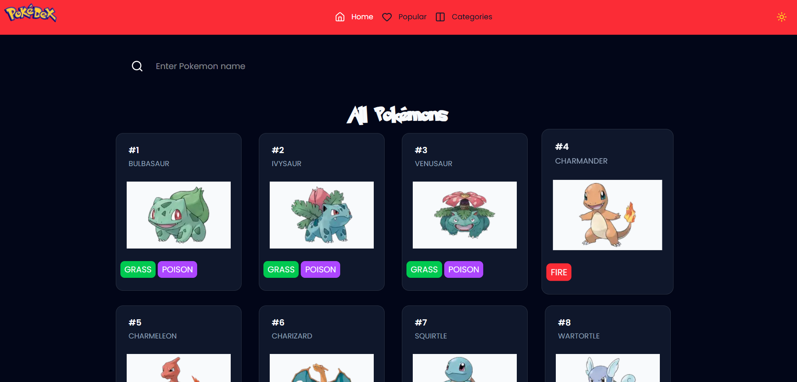

# PokedexV2  



A modern, responsive Pokémon‑browser built with Next.js, TypeScript & Tailwind CSS.  
Explore Pokémon data (powered by the PokéAPI), view details, and navigate a slick UI.

## 🚀 Live Demo  
[https://pokedex-two-rouge.vercel.app](https://pokedex-two-rouge.vercel.app) :contentReference[oaicite:2]{index=2}

## 🧩 Built With  
- [Next.js](https://nextjs.org)  
- TypeScript  
- Tailwind CSS  
- CSS Modules / modern styling  
- PokéAPI (for Pokémon data)  
- (Optional) Image optimization, lazy‐loading, routing  

## 🎯 Key Features  
- Browse a list/grid of Pokémon.  
- View detailed page for each Pokémon (stats, abilities, image).  
- Responsive layout — works on mobile, tablet & desktop.  
- Clean UI with a card‐based design and smooth user experience.  
- Performance optimisations (image loading, caching, SEO friendly).

## 🛠 Getting Started  
### Prerequisites  
- Node.js (v16+ recommended)  
- npm or Yarn  

### Installation & Running Locally  
```bash
# Clone the repository  
git clone https://github.com/SujibShrestha/pokedexV2.git  
cd pokedexV2  

# Install dependencies  
npm install  
# or  
yarn install  

# Run the development server  
npm run dev  
# or  
yarn dev  
